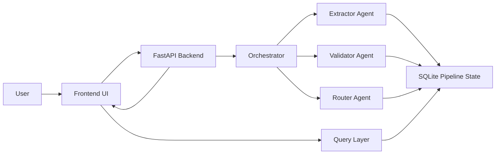

# Technical Write-up

## Architecture

The system is intentionally simple. The frontend is a single-page HTML and JavaScript interface served by FastAPI. When a user uploads a document, the backend writes it to a local `uploads/` folder and starts a sequential orchestrator. The orchestrator invokes the extractor, validator, and router in order, persisting output from each step into SQLite under a unique `document_id`. This produces a durable audit trail and creates a clean seam for future resume or retry logic.

The extractor supports two execution paths. If `OPENAI_API_KEY` is configured, the backend sends the document to an OpenAI vision-capable model with a structured extraction prompt. If no key is present or the LLM call fails, the app falls back to local extraction using PyMuPDF for PDF text capture and RapidOCR for image OCR. This fallback is not production-grade compared with a true vision model, but it makes the POC demoable on a local machine without depending on remote credentials.

The validator is deterministic code rather than another LLM call. That choice improves auditability and makes rule evaluation easy to defend. It enforces the assignment's critical policy: any null or low-confidence required field becomes `uncertain`, not `mismatch`, and is never silently approved. The router is also deterministic in this POC. It maps validation outcomes into one of three operational decisions and always attaches reasoning plus action items.

The query layer supports natural-language analytics over the `pipeline_runs` table. With an API key, it can use an LLM to generate SQL against the known schema. Without a key, it handles a handful of high-value demo questions with a pattern-based translator. This gives the assignment the required query experience while keeping the local fallback robust.

## Three Nastiest Failure Modes

### 1. Plausible but wrong extraction

The most dangerous failure mode is not a missing field; it is a wrong field returned with high confidence. During testing, the riskiest example is an Incoterm or port being read as a nearby visually similar token. The mitigation in this POC is conservative downstream handling: auto-approval requires both a rule match and high confidence. In a production version, I would pair visual extraction with raw OCR text and possibly a document region trace for each field.

### 2. Required field missing but accidentally treated as mismatch

A null HS code or unreadable port could easily be interpreted as a mismatch if the system only compared values mechanically. That would send the wrong operational signal because the right next step is investigation, not amendment. The validator solves this by explicitly branching null and low-confidence cases into `uncertain`, preserving the distinction between missing evidence and bad evidence.

### 3. Router overreacts to noisy validation signals

If several required fields are uncertain, a weak routing layer can produce inconsistent next steps or confusing explanations. The POC avoids that by using deterministic routing rules. Required mismatches always trigger amendment. Uncertain or medium-confidence required fields trigger human review. Only uniformly strong matches clear auto-approval. This sacrifices some flexibility but keeps operator trust high.

## Observability

Each pipeline run should carry a `document_id` through every log line and storage event. For a production rollout across dozens of customers, I would log agent name, input hash, output payload, latency, token usage, fallback mode, and final decision. A simple dashboard should track extraction success rate, validation mismatch distribution, false approval rate, average latency per stage, and cost per document.

## Cost and Latency

The extractor is the dominant cost and latency hop because vision models are expensive relative to text models and document payloads are larger. A practical budget is roughly $0.015 to $0.035 per document end to end, depending on page count and retries. Latency is mostly bounded by extraction, which may take five to fifteen seconds for a single-page document. The UI can reduce perceived wait time by showing live stage status, which this POC does already.

## What I Would Do With One More Week

The next layer of maturity would be automatic email ingestion, a proper evaluation harness with labeled sample documents, region-level extraction evidence, and multi-page PDF support with per-page aggregation. I would also make the query layer safer by validating generated SQL against an allowlist and add a review inbox optimized for CG operators instead of a generic result view.
