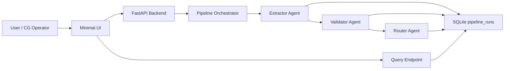

# Technical Write-Up - GoComet Nova Trade Document Pipeline

## Architecture

The pipeline is intentionally simple. FastAPI accepts a file upload, creates a `document_id`, and stores a run record in SQLite. The orchestrator then executes extractor, validator, and router in sequence, persisting each output back into the same row. That persistence is the crash-recovery boundary. The frontend polls the run record and renders the current stage plus the latest stored payloads.

## Three Nastiest Failure Modes

### 1. Plausible but wrong extraction with high confidence
During testing, the noisy sample image made field boundaries less clear than the clean invoice. A production vision model could easily read a similar Incoterm incorrectly while sounding confident. The mitigation is to combine the raw document with OCR text or document text, keep per-field confidence visible, and treat borderline confidence as non-approvable for required fields.

### 2. Missing required field incorrectly treated as a mismatch
The more dangerous path is when a required field is absent or unreadable and the system acts as though it confidently knows the value is wrong. That leads to noisy amendment requests and user distrust. The validator explicitly routes all null or sub-threshold required values to `uncertain` rather than `mismatch`, which preserves the right operational next step: human review, not supplier blame.

### 3. Router overcommits when the signal is weak
If several required fields are uncertain, a free-form router prompt can still force an overconfident decision. The mitigation in this POC is deterministic policy before language generation: required mismatches create amendment drafts, uncertainty on required fields flags for review, and only strong clean matches auto-approve. The LLM path is optional, not trusted blindly.

## Observability

Every run is keyed by `document_id`, which should appear in logs, traces, and any downstream notifications. In production I would log agent name, input hash, output summary, latency, token usage, retry count, and final decision. The core dashboard would show run success rate, agent-level latency, cost per document, uncertain-field rate, false approval rate, and top recurring mismatch fields by customer.

## Cost and Latency

The slowest and most expensive step is extraction because vision understanding dominates both token usage and response time. A reasonable back-of-envelope cost is roughly $0.015 to $0.035 per document in a production setup, with extraction as the largest share. Costs spike on multi-page PDFs, repeated retries, and oversized prompts. Latency typically bottlenecks at the extractor, which is why streaming partial status to the UI matters.

## What I'd Change With a Week

With more time I would add email ingestion, a better eval harness with labeled trade documents, and multi-page PDF page-merging logic. I would also replace the heuristic offline fallback for images with a proper OCR layer so the demo path remains strong even without external LLM credentials.
